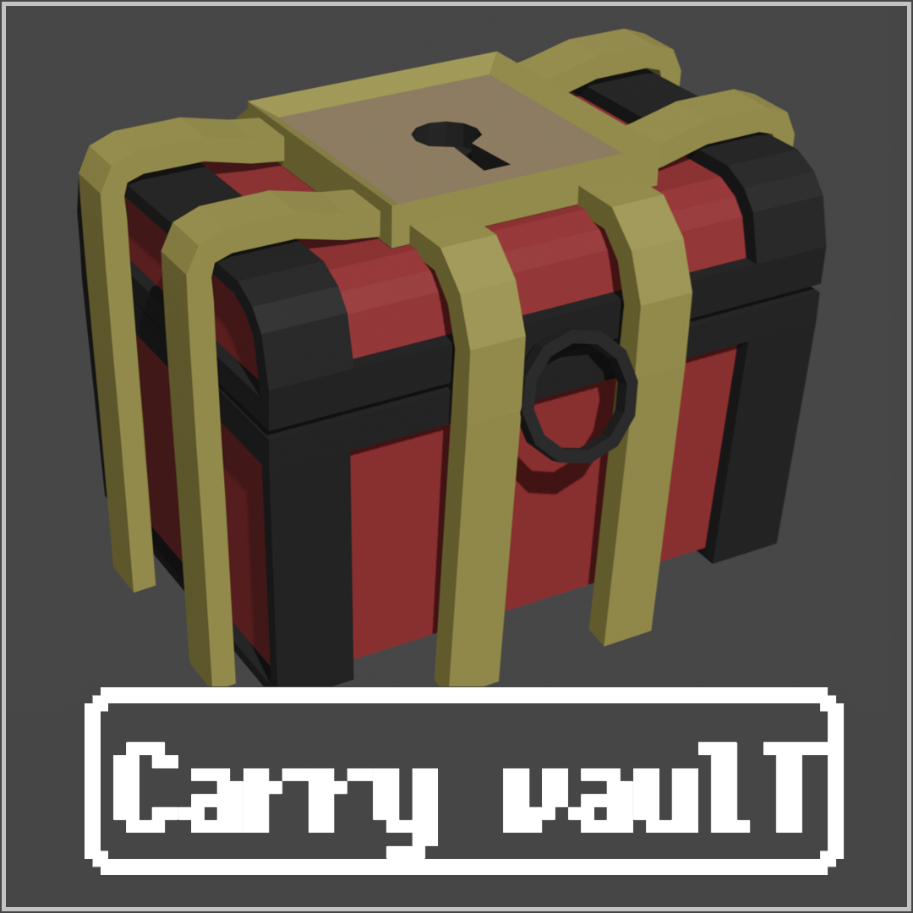
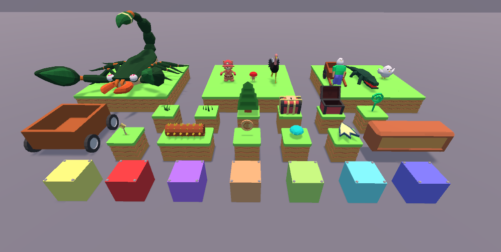
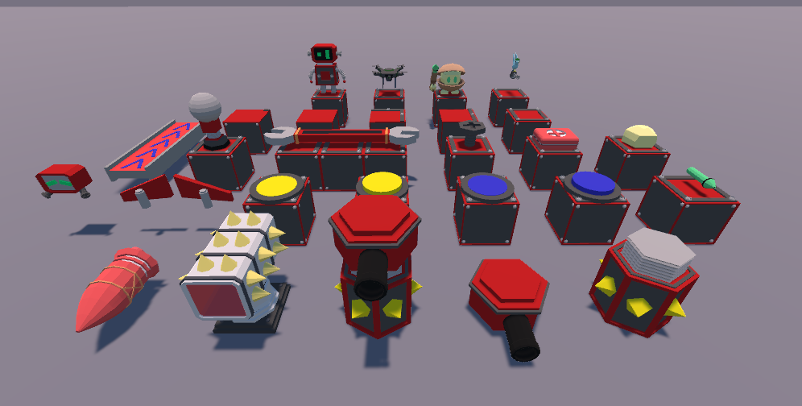
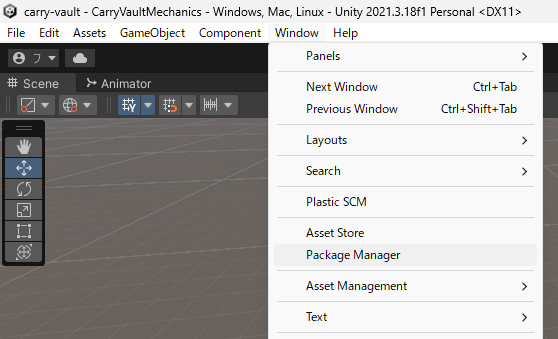
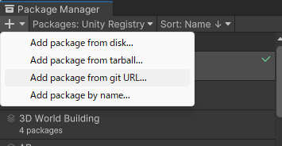
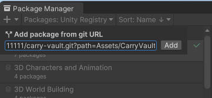

<div align="center">
    <p>
        
    </p>
</div>

# 🎁 Carry Vault

<div align="center">
    <p>
        
        
    </p>
</div>

Japanese version of README is [here](./README_ja.md).

A repository for distributing assets of 3D models created for Unity.

## Theme

Unlock the vault to a world of creativity!

CarryVault is a Unity package designed for distributing 3D models with a twist of fun.
This package offers low-poly, vibrant models perfect for a variety of themes including fantasy realms, robot companions, and ancient ruins.

With built-in animations, it's never been easier to bring your scenes to life.
Whether you're building a whimsical world or an epic adventure, CarryVault is here to carry your ideas to the next level.

## Overview

In the course of creating games, I had hoped to someday distribute all the 3D models I had created, but it was difficult to do so because I didn't know where to distribute them, ~~and it was too much trouble to begin with~~.
However, I learned that UPM (Unity Package Manager) makes it easy to distribute assets, so I created this repository.

Since many of the models were created while studying Blender, I cannot guarantee the quality, but I have set the terms of use relatively loosely, so please feel free to use them.

Since many of the models are low-poly, they have low rendering load and can be applied to various scenes.
If you want to combine them with other assets, I think you'll find that the atmosphere matches well if you look for other low-poly assets.

## How to use

It can be installed using the Unity Package Manager.

<div align="center">
    <p>
        
    </p>
</div>

Select "Window" -> "Package Manager" from the Unity menu, click the "+" button, and then "Add package from git URL...".Click the "+" button and select "Add package from git URL...".

<div align="center">
    <p>
        
        
    </p>
</div>

Enter the following URL and click the "Add" button.

```bash
https://github.com/hase111111/carry-vault.git?path=Assets/CarryVault
```

Installation is now complete.

### Assets included in the package

Assets included in the package are

- Materials: Materials to be applied to the 3D model
- Models: fbx file of 3D model
- Prefabs: Prefabricated 3D model
- Scripts: Scripts to be applied to 3D models
- Textures: Textures to be applied to the 3D model

## License

Carry Vault is distributed under the MIT License.
Therefore, you are free to use it for both personal and commercial use.

The following are some notes on the use of Carry Vault.

- You are free to use Carry Vault for both personal and commercial use.
- You are free to distribute, publish, and sell your work using Carry Vault assets.
- All assets may be freely edited and modified.
- You do not need to submit an application or report before use.You are free to use any of the Carry Vault assets, and you are free to use any of the Carry Vault assets without crediting us.
- You can use the assets with game engines other than Unity.
- You may use the assets for purposes other than games (research, video production, illustration production, etc.).

Regardless of whether it is for personal or commercial use, we ask that you refrain from the following

- Use for purposes that are offensive to public order and morals or antisocial.
- Use for political or religious purposes, such as election campaigning or religious activities

If you have any questions about how to use the site, please contact us by e-mail.

### Contact

- E-Mail: hasehasehase61@gmail.com

## 3D Models

The original data (blend and fbx files) are located in the RawData directory.
They are all created in Blender.