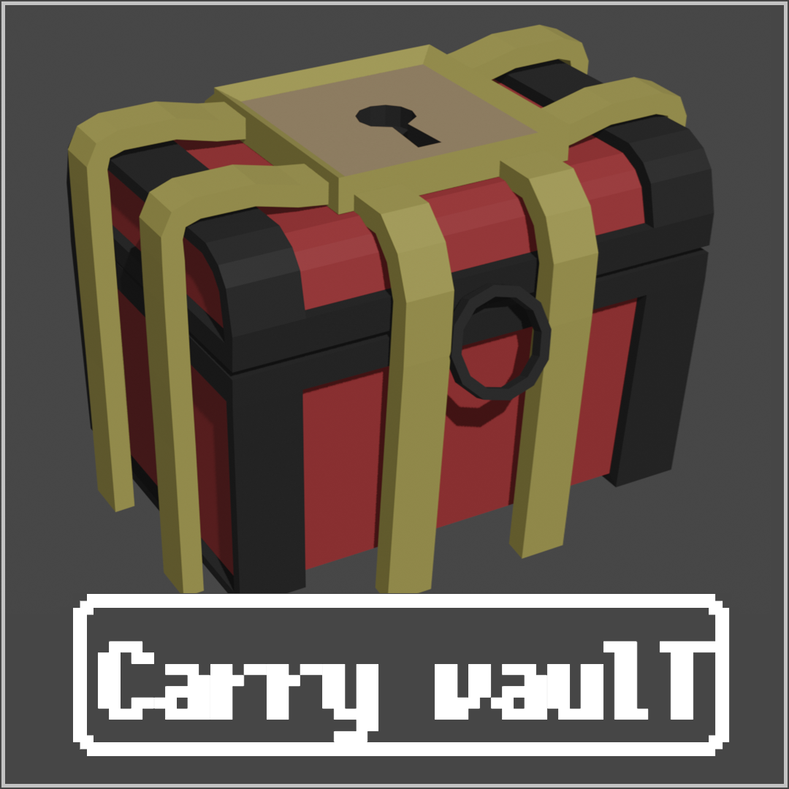
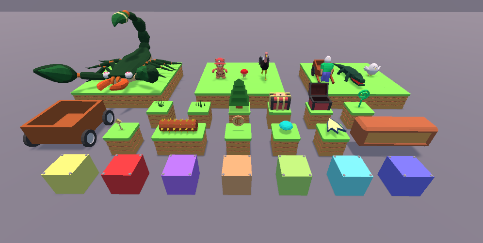
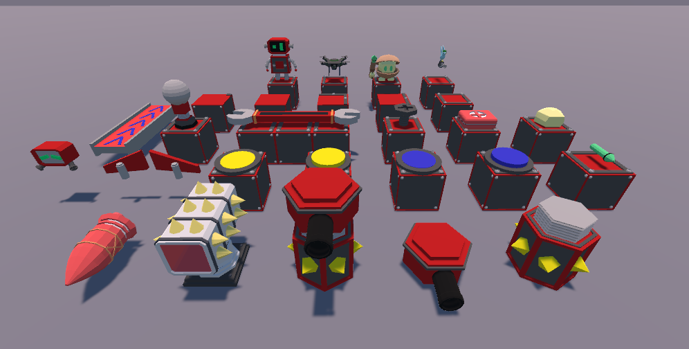
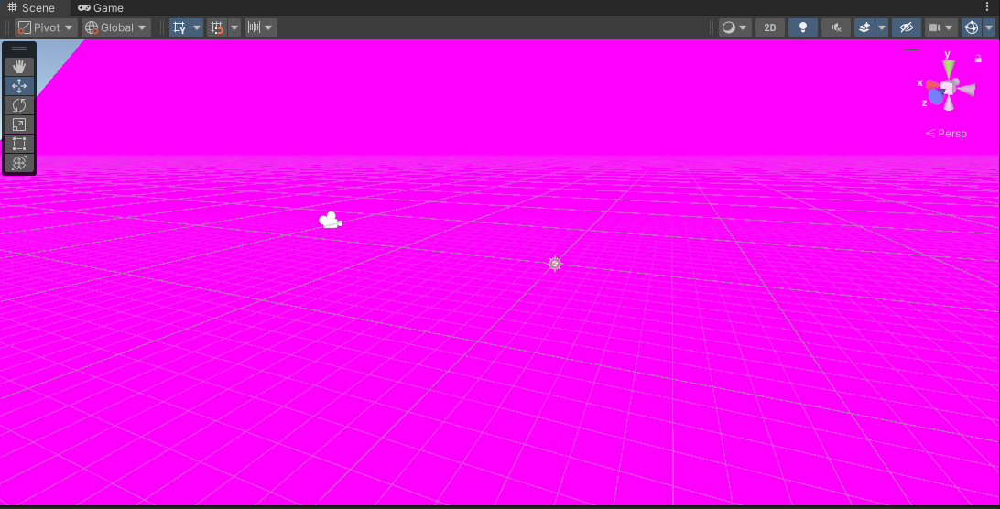

<div align="center">
    <p>
        
    </p>
</div>


# 🎁 Carry Vault

<div align="center">
    <p>
        
        
    </p>
</div>

英語版のREADMEは[こちら](./README.md)です。

Unity向けに作成した3Dモデルのアセットを配布するためのレポジトリです。

## テーマ

創造性の世界への金庫の鍵を開けよう！

CarryVaultは、遊び心のある3Dモデルを配布するためにデザインされたUnityパッケージです。
このパッケージは、ファンタジーの世界、ロボットの仲間、古代の遺跡など、さまざまなテーマに最適なローポリで鮮やかなモデルを提供します。

アニメーションが内蔵されているので、シーンに命を吹き込むのがかつてないほど簡単になりました。
気まぐれな世界や壮大な冒険など、CarryVaultはあなたのアイデアを次のレベルへと導きます。

## 概要

ゲーム制作をする中で，「作成してきた3Dモデルをいつかまとめて配布したい」と考えていましたが，
どこで配布すればいいかわからない，~~そもそも面倒くさい~~，という理由でなかなか実現できませんでした。
しかし，UPM（Unity Package Manager）を使えば，簡単にアセットを配布できることを知り，このレポジトリを作成しました。

モデルの多くはBlenderを勉強しながら作成したものであるため，クオリティは保証できませんが，
利用規約を比較的緩く設定しているので，気軽にご利用いただければと思います。

全体的にLow Polyなモデルが多いため，描画の負荷が少なくさまざまなシーンに適用できると思います。
また，他のアセットと組み合わせたい場合は，同様にLow Polyなアセットを探すと雰囲気が合うと思います。

## 使用方法

Unity Package Managerを使ってインストールできます。

<div align="center">
    <p>
        
    </p>
</div>

Unityのメニューから「Window」→「Package Manager」を選択し，「+」ボタンをクリックして「Add package from git URL...」を選択します。

<div align="center">
    <p>
        
        
    </p>
</div>

以下のURLを入力して「Add」ボタンをクリックします。

```bash
https://github.com/hase111111/carry-vault.git?path=Assets/CarryVault
```

以上でインストール完了です。

### パッケージに含まれるアセット

パッケージに含まれるアセットは以下の通りです。

- Materials: 3Dモデルに適用するマテリアル
- Models: 3Dモデルのfbxファイル
- Prefabs: 3Dモデルをプレハブ化したもの
- Scripts: 3Dモデルに適用するスクリプト
- Textures: 3Dモデルに適用するテクスチャ

## 利用上の注意

Carry VaultはMITライセンスで配布しています。
そのため，個人利用・商用利用を問わず自由にご利用いただけます。

以下に利用上の注意を記載します。

- 個人利用・商用利用を問わず自由にご利用いただけます。
- Carry Vaultのアセットを使用した作品の配布・公開・販売も自由です。
- すべてのアセットの編集・改編は自由です。
- ご利用前の申請や事後報告は不要です。また，ご利用にあたってのクレジット表記は任意です。
- Unity以外のゲームエンジンでもご利用いただけます。
- ゲーム以外の用途（研究，動画制作，イラスト制作など）でもご利用いただけます。

個人利用・商用利用を問わず，以下の利用はお控えいただけると幸いです。

- 公序良俗に反する目的や，反社会的な目的での利用
- 選挙活動や宗教活動など，政治的・宗教的な目的での利用

利用方法についての質問がある場合は，メールにてお問い合わせください。

## 3D Models

元のデータ（blendファイル，fbxファイル）はRawDataディレクトリにあります。
これらはすべてBlenderで作成されています。

モデルの編集を行う場合は，このデータを使用してください。

## URP環境下での利用方法

Carry VaultはUniversal Render Pipeline（URP）環境下で表示すると，マテリアルが正しく表示されない場合があります。



このような場合は，以下の手順でマテリアルを修正してください。

- CarryVaultフォルダ内のMaterialsフォルダを開く
- マテリアルをクリックする
- 画面上部のメニューから，「Edit」→「Rendering」→「Materials」→「Convert Selected Build-in Material to URP」を選択する

<div align="center">
    <p>
        
        
    </p>
</div>

これで，マテリアルがURP環境下で正しく表示されるようになります。


## お問い合わせ

- メール: hasehasehase61@gmail.com